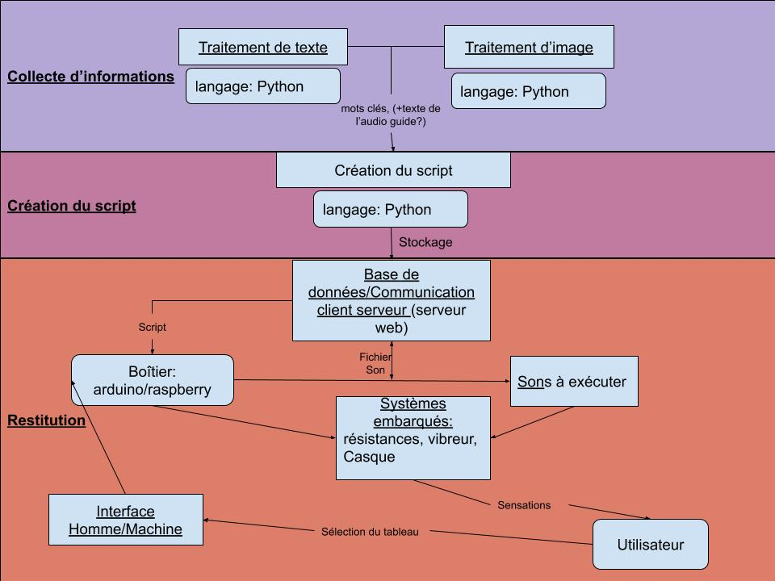

=== Schéma d’architecture

===== Traitement de texte
La base de données du Louvre nous donne accès pour chaque oeuvre à un
court texte descriptif. Afin de retranscrire les émotions provoquées par
l'oeuvre au mieux, nous allons analyser le texte afin d'en extraire des
informations sur les couleurs, les éléments présents, la lumière, etc.
Cette analyse sera faite via une intelligence artificiel codée en python
avec la bibliothèque TensorFlow.

===== Traitement d'image

L'image est notre seconde source d'information. Avec une intelligence
artificielle codée en python avec la bibliothèque TensorFlow, nous allons
extraire des informations relatives aux éléments présents sur le
tableau, les couleurs, la lumière, etc. Il sera également possible
de déterminer un vecteur de style de l'oeuvre pour retransmettre au
mieux les émotions provoquées par le tableau.

===== Création du script

Toutes les informations extraites du texte et de l'image doivent être
interprétées et compilées dans le script. Il faut que le script soit
directement interprétable par le boitier et les sensations transmises
doivent être agréables, orchestrées et dotées d'une réelle intention
artistique.

===== Base de données/Communication client serveur

Cette base de données est composée de deux parties :
Premièrement les scripts relatifs à chaque oeuvre (sans les fichiers sons)
Deuxièmement les fichiers sons
Le boitier reçois le script, lorsque ce dernier a besoin d'un fichier
son, il le demande à la base de données pour le diffuser dans le casque.

===== Boîtier: arduino/raspberry

Le boîtier contient une raspberry afin de communiquer avec le serveur
(Bloc ci-dessus) ainsi qu'une carte arduino afin de contrôler les
différents systèmes embarqués.

===== Systèmes embarqués

Au sein du boîtier, plusieurs systèmes embarqués permettent de transmettre
des sensations : des résistances pour la chaleur, un système générant de la fraicheur, des vibreurs ainsi qu'un casque pour le son.

===== Interface Homme/Machine

L'objectif principal sera de rendre cette interface accessible aux
personnes malvoyantes. Pour savoir comment réaliser cette interface
nous allons contacter des personnes malvoyantes pour qu'elles nous
disent ce dont elles sont besoin/envie. Nous ne savons donc pas encore
exactement à quoi cette interface ressemblera. L'idée est de permettre
à l'utilisateur de selectionner l'oeuvre qu'il souhaite ressentir.
Pour l'instant nous avons imaginé une interface audio assez simple avec
deux boutons de sélections, un bouton de confirmation ainsi que deux
boutons pour régler le volume.

