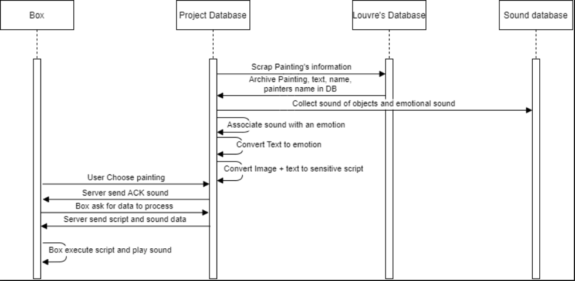

# Plan d'intégration continue du projet

## Rappel de notre projet et de ses interfaces

### Rappel de l'objectif de notre projet

Notre projet consiste en la création d'un boîtier, à destination des personnes malvoyantes, générant des sensations autre que visuels permettant ainsi de pouvoir retranscrire une peinture. Pour se faire un traitement préalable des peintures devra être réalisé par les différents modules via l'analyse d'image brute, l'analyse de commentaire et enfin la génération de son utilisé par le boîtier. Pour stocker et faciliter l'accès aux données une base de données sera créée reliée à un service web contenant les script des sensations à reproduire pour chaque oeuvre. Le boîtier aura donc uniquement à effectuer une requête web pour pouvoir récupérer le script et l'exécuter.

### Diagramme en séquence

### Explication du diagramme

Comme il est possible de le voir la majorité de notre projet s'exécute sur un serveur. En effet la grande majorité des modules lisent les données présent dans la base de données, les traitent et écrivent le résultat du traitement de ces dernières dans la base de données.
L'objectif du module test et intégration sera donc de vérifier le bon fonctionnement du lien entre la base de données et les différents module afin d'intégrer la totalité du projet et de pouvoir créer des releases.

## Organisation du dépot Git
- Explication des merge conflict et de comment les résoudre aux membres

Debug d'un merge conflict avec les membres du projet pour qu'ils puissent eux même les résoudre.

- Constitution de branches pour chaque module

Les membres d'un même module sont responsable de la branche de leur module qui sert de backup pour leur code. Il peuvent ainsi faire régulièrement des push afin de backuper et partager aux autres membre du module leur code.

- Branche _develop_

La branche de développement _develop_ servira pour les tests entre les modules deux à deux. 
Compte tenu de l'organisation de notre projet il s'agira essentiellement de tester le lien entre la base de données et les modules lisant et modifiant les données. Des tests automatiques seront mis en place sur cette branche. Ainsi si un module est prêt à être testé il suffira de merge la branche du module dans la branch _develop_.

- Branche _master_

Une fois les tests des modules deux à deux passés avec succès, les responsable tests et intégration se chargerons de merger _develop_ dans _master_. Sur la branche _master_ des tests d'intégration de la totalité du projet depuis la création de la base de données jusqu'à la récupération du script par le module système embarqué.

- Branche _release_

Une fois tous ces tests passés il sera possible pour les responsables tests et intégration de déployer le projet sous forme d'une release (archive.zip contenant le code et le script d'installation du projet) dans la branche release.

## Tests à réaliser sur la branch _develop_

- Mise en place de la base de données

Il faudra mettre en place sur une image docker la base de données ainsi qu'un service web.

- Lecture et écriture dans la BDD par le module _IA\_image_

Vérification de la lecture des images (et nom des oeuvres) et de l'écriture de la sortie (script) après traitement dans la base de données.

//TODO: Find branch name for every modules
- Lecture et écriture dans la BDD par le module analyse de texte

De même il faudra vérifier que l'accès au textes depuis la base de données est fonctionnel et vérifier que l'écriture des données de sorties (émotion) sont bien sous forme d'un texte s'écrivant bien dans la base de données.

- Ecriture dans la base de données pour le module _Son_ 

Test d'ajout de son dans la base de données et vérification du format.

- Lecture du script et des ressources sonnores dans la base de données pour le module _systemes\_embarques_

Test de la présence de chaque script pour chaque oeuvre sur le service web de l'image docker. Test du format du script et de l'accès aux ressources sonores

- Test final de l'intégration de la totalité des modules

Verification de l'exécutation de chaque module étape par étape et création de la release si les tests passent.
